# MÒDUL: M07 - activitat 15 
### Feta per: Víctor Fernández i Albert Penadés 

## Inici projecte botiga:

## Estructura projecte:
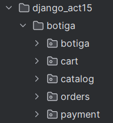

### Creació de la taula 'catalog_product'
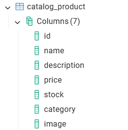

## CRUD (catalog_product):
### CREATE:
### · url
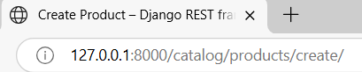

### Crear product:
#### · Body del .json
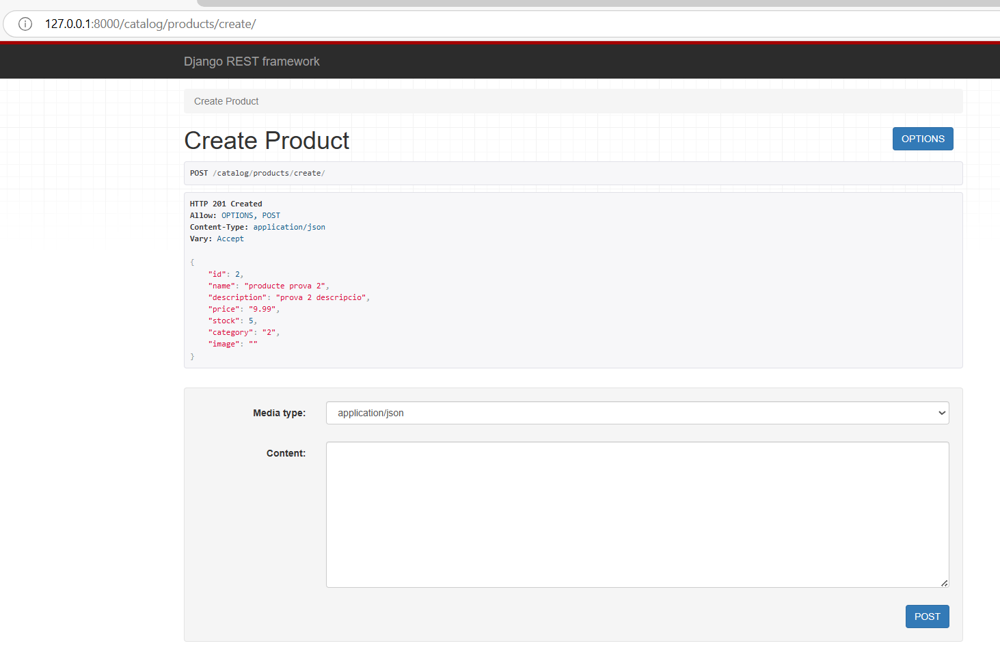

### Insert en la taula 'Product'
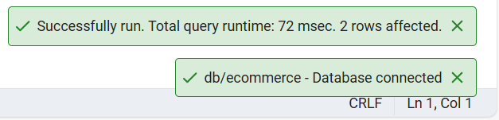
#### · Resultat:
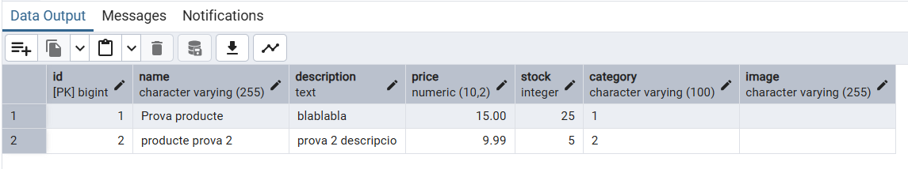

## READ
### · url per id

### Llegir product:
#### · Body del .json per id
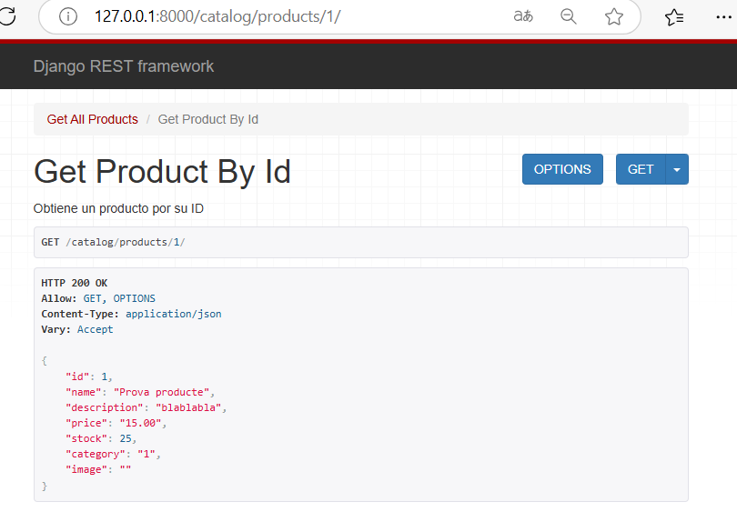

### · url tots els productes

### Llegir product:
#### · Body del .json tots els productes
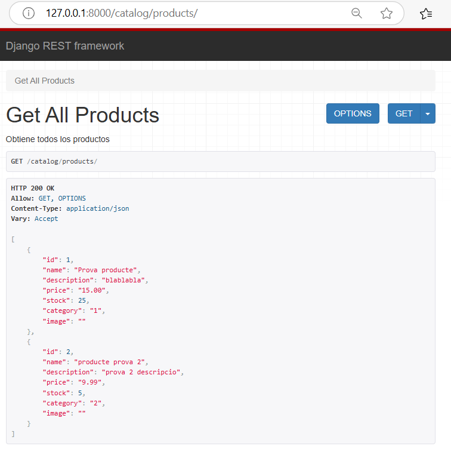

## UPDATE
### · url

### Actualitzar product:
#### · Body del .json
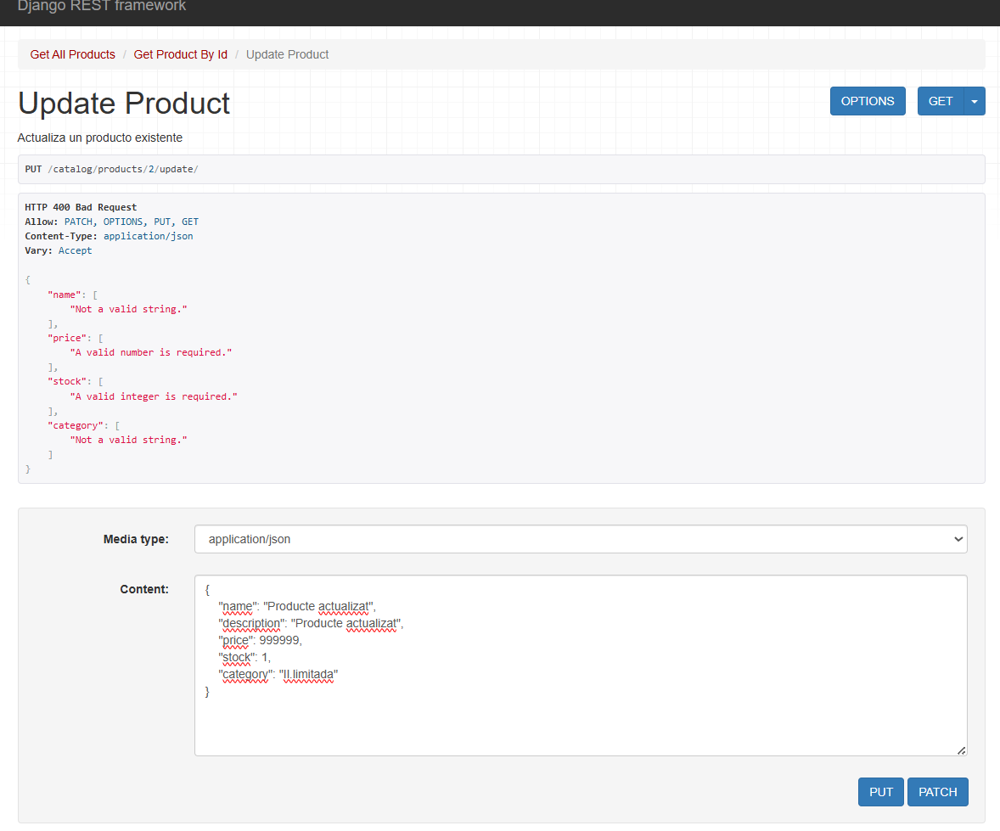
#### · Resposta dins de la terminal (Pycharm)
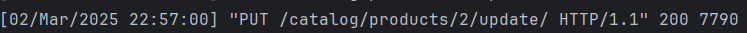
### Resultat final dins de la bbdd
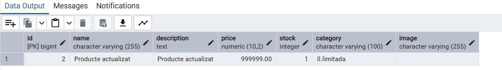

## DELETE
### · url

### Eliminar product:
#### · Body del .json
#### · Confirmem

#### · Resposta dins de la terminal (Pycharm)
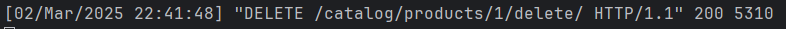

· Veiem que tot funciona correctament
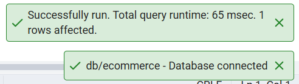

### Resultat final i resposta .json
· Taula actualitzada
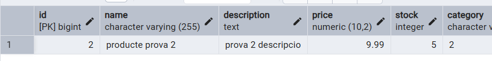

· Missatge del .json
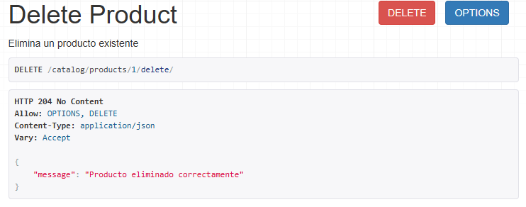